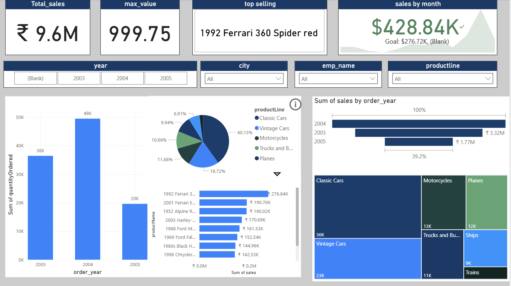

# 📊 Power BI Sales Dashboard Project

## 👩‍💻 Created by: Surbhi Singh

This project was built during my Power BI learning journey, inspired by the [Power BI Full Course for Beginners](https://youtu.be/bQ-HTp-tx40). It simulates a real-world scenario where business sales data is analyzed and visualized through interactive dashboards.

The final report provides a 360° overview of business performance across time, geography, and products — helping users uncover actionable insights at a glance.

---

## 🛠 Tools & Technologies Used

- Power BI Desktop  
- Power Query Editor  
- DAX (Data Analysis Expressions)  
- Excel Dataset (Sales Orders)

---

## 📁 Project Structure

```
📦 PowerBI-Sales-Dashboard
 ┣ 📊 Dashboard.pbix
 ┣ 📂 assets/
 ┃ ┣ screenshot1.png
 ┃ ┣ screenshot2.png
 ┃ ┣ screenshot3.png
 ┃ ┗ screenshot4.png
 ┣ 📂 data/
 ┃ ┗ sales_data.xlsx
 ┗ 📄 README.md
```

---

## 📸 Dashboard Screenshots


### 1️⃣ Sales Trend Over Time  
_Description: Shows sales over time with forecasting, spikes, and outlier detection._


---

### 2️⃣ Category-Level Performance  
_Description: Visualizes total revenue and units sold by product line and year._


---

### 3️⃣ Top Product Analysis  
_Description: Highlights the top-performing products, such as the 1992 Ferrari 360 Spider Red._


---

### 4️⃣ Final Interactive Executive Dashboard  
_Description: Combines all visuals, filters, KPIs, and interactivity in one polished view._


---

## 📈 Insights Derived

- 📅 **2004** was the most successful year with ₹4.5M+ in sales  
- 🏎️ **Classic Cars** were the top-performing category  
- 🚗 **1992 Ferrari 360 Spider Red** had the highest sales and units  
- 📉 **2005** showed a sales decline, indicating a potential business concern  

---

## 🎯 Learning Outcomes

- Cleaned and transformed raw data using Power Query  
- Created DAX measures for KPIs and performance indicators  
- Built a dynamic and interactive dashboard with slicers and drill-throughs  
- Learned to tell meaningful stories through visuals  

---

## ✅ How to Run

1. Clone or download the repo  
2. Open `Dashboard.pbix` in Power BI Desktop  
3. Explore the visuals, slicers, and filters  
4. Optionally, replace the data file to test with new data  

---

## 🙋‍♀️ About Me

I'm **Surbhi Singh**, a B.Tech Computer Science student passionate about data, storytelling, and analytics. This project reflects my journey into turning raw data into real business insights.

📌 [LinkedIn](https://www.linkedin.com/in/surbhi-singh-720113297/)  
💻 [GitHub](https://github.com/Surbhi28singh)

---

⭐ If you like this project, feel free to star the repo and share your thoughts!
